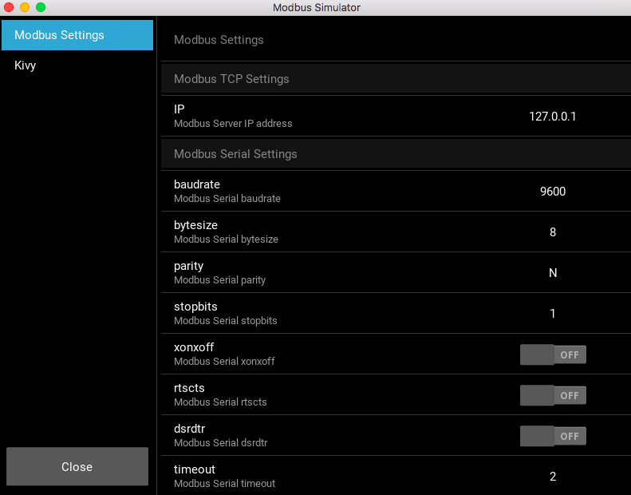

# Modbus Simulator

Modbus Simulator with GUI based on Pymodbus

## Installation
    $ pip install git+https://github.com/riptideio/modbus-simulator.git
    $ python -m modbus_simulator


## Checking Out the Source
    $ git clone https://github.com/riptideio/modbus-simulator.git
    $ cd modbus-simulator


## Development Instructions
1. create virtualenv and install requirements

    ```
    $ pip install -r requirements

    ```


3. [Setup development environment](https://github.com/kivy/kivy/wiki/Setting-Up-Kivy-with-various-popular-IDE's)

## Running/Testing application

To run simulation, run `python -m modbus_simulator`


A GUi should show up if all the requirements are met !!


All the settings for various modbus related settings (block size/minimum/maximun values/logging) could be set and accessed from settings panel (use F1 or click on Settings icon at the bottom)


## Usage instructions
[](https://www.youtube.com/watch?v=a5-OridSlt8)

## Packaging for different OS (Standalone applications)
A standalone application specific to target OS can be created with Kivy package manager

1. [OSX](https://kivy.org/docs/guide/packaging-osx.html)
2. [Linux](http://bitstream.io/packaging-and-distributing-a-kivy-application-on-linux.html)
3. [Windows](http://kivy.org/docs/guide/packaging-windows.html)


# NOTE:
A cli version supporting both Modbus_RTU and Modbus_TCP is available here [modbus_simu_cli](https://github.com/dhoomakethu/modbus_sim_cli)
